# STM32 to NXP Platform Intelligent Migration Workflow

## Project Overview

An intelligent STM32 to NXP platform migration solution based on MCU Code Analyzer, achieving automated cross-platform code reconstruction through intelligent analysis and LLM assistance.

## Complete PlantUML Workflow

## Compact Version for PPT (Half Page)

```plantuml
@startuml STM32_to_NXP_Compact_English
!theme plain
skinparam activity {
    BackgroundColor #E8F4FD
    BorderColor #2196F3
    FontSize 11
}
skinparam decision {
    BackgroundColor #FFF8E1
    BorderColor #FF9800
    FontSize 10
}
skinparam note {
    BackgroundColor #F3E5F5
    FontSize 9
}

title STM32→NXP Functional Reconstruction Workflow

start

:Select STM32 Project;
:MCU Analyzer Parsing;
note right: Chip Model + Interfaces + Call Graph

:LLM1 Functional Analysis;
note right: Extract Function Description

if (Confirm Functions?) then (Modify)
    :User Correction;
    stop
else (Confirm)
endif

:Select NXP Chip;
note right: Smart Recommendation or Manual

:Obtain NXP BSP;

:LLM2 Rebuild Project;
note right: Function Description + BSP → New Project

:Output NXP Project;

if (Verification Satisfied?) then (Improve)
    :Feedback Rebuild;
    stop
else (Satisfied)
    :Complete;
endif

stop

@enduml
```

## Core Features

### 🎯 Intelligent Migration Process
1. **Automatic Analysis**: Deep parsing of STM32 project structure and chip information
2. **LLM Assistance**: Intelligent generation of project profiles and code conversion
3. **Chip Matching**: Automatic recommendation of suitable NXP chips based on specifications
4. **Code Generation**: Maintain logic structure while replacing with NXP platform APIs
5. **Iterative Optimization**: Support user feedback and continuous improvement

### 🚀 Technical Advantages
- **High Automation**: Reduce 90% of manual migration workload
- **Strong Accuracy**: Multi-layer verification mechanism ensures migration quality
- **User Friendly**: Graphical interface with intuitive workflow guidance
- **Professional**: Specialized solution for embedded development

### 💡 Key Concept
This is **functional reconstruction**, not direct code porting:
- **LLM1**: Analyzes STM32 project → Extracts functional description
- **User**: Selects corresponding NXP chip
- **LLM2**: Based on functional description + NXP BSP → Generates new NXP project

---

