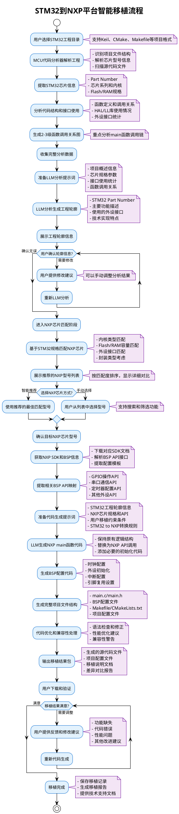
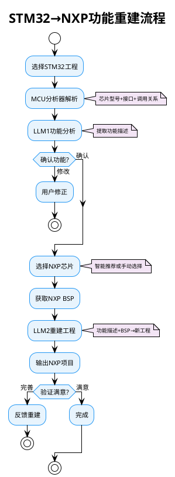

# STM32到NXP平台智能移植流程图

## 项目概述

基于MCU代码分析器的STM32到NXP平台移植解决方案，通过智能分析和LLM辅助，实现跨平台代码自动化移植。

## PlantUML流程图

## 核心特点

### 🎯 智能化移植流程
1. **自动分析**：深度解析STM32工程结构和芯片信息
2. **LLM辅助**：智能生成工程轮廓和代码转换
3. **芯片匹配**：基于规格自动推荐合适的NXP芯片
4. **代码生成**：保持逻辑结构，替换为NXP平台API
5. **迭代优化**：支持用户反馈和持续改进

### 🚀 技术优势
- **高度自动化**：减少90%的手工移植工作量
- **准确性强**：多层验证机制确保移植质量
- **用户友好**：图形化界面，直观的流程引导
- **专业性强**：针对嵌入式开发的专业化解决方案

---

## 精简版流程图（适合PPT半页）

---

